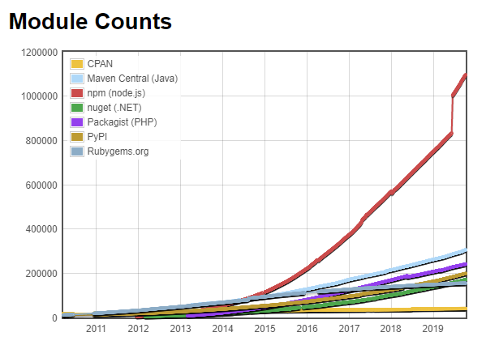

# Fyrirlestur 7.1 – Node.js og NPM

## Vefforritun 1 — TÖL107G

### Andri Valur Guðjohnsen, [avg4@hi.is](mailto:avg4@hi.is)

---

## Node.js

* Verkvangur (platform) byggður á V8 til að smíða hröð, skalanleg netforrit
* Notar atburðadrifið, ekki-blokkandi I/O módel sem gerir það létt, skilvirkt og fullkomið fyrir rauntíma forrit sem meðhöndla mikil gögn yfir dreifð kerfi
* Notað til að búa til allskonar forrit, bæði _bakenda_, _CLI_ o.fl.

***

* Ekki forritunarmál, JavaScript er forritunarmálið sem node notar
  - Samleðgaráhrif með framenda, _eitt mál fyrir framenda og bakenda_ getur heillað
  - Samt **ekki** sama keyrsluumhverfið!
* Ekki framework (einsog t.d. Rails eða Django) en getur verið notað til að búa þannig til

---

## npm

* npm er _pakkastjóri_ (package manager) fyrir JavaScript
  - leyfir okkur líka að setja upp og nota allskonar tól sem byggð eru með JavaScript
* Sett upp með _[node.js](https://nodejs.org/)_

***

## Pakkastjóri

* Pakkastjóri sér um að sjálfvirknivæða það að setja upp, stilla og fjarlægja hugbúnað
  - í staðinn fyrir að þurfa að sækja einhvern hugbúnað...
  - finna hvert við sóttum hann...
  - keyra eitthvað uppsetningarforrit...
  - síðan keyra forritið

***

* Keyrum í staðin eina skipun og höfum aðgang að forriti
* Vistar einnig _hvaða_ forrit verkefni notar svo aðrir geta sótt

***

## NPM

* Hellingur til af NPM módúlum/pökkum sem geta einfaldað okkur lífið
* Sækjum með npm og tilgreinum þannig að forritið okkar þarfnist þessa pakka
  - Skilgreinum _dependency_ á pakkann
  - Vistað í `package.json` ásamt útgáfunúmeri

***

## NPM pakkar



http://www.modulecounts.com/

***

## npm install `<module>`

* Skipun til að setja upp `<module>` einingu eftir nafni, t.d. `browser-sync`
* NPM byrjar á að athuga hver er nýjasta útgáfa af `<module>`, ef einhver
* Sækir útgáfuna

***

* Sækir alla pakka sem `<module>` þarf (og pakka sem þeir pakka þurfa o.s.fr.)
* Geymir alla pakka eins útflatta og hægt er í `/node_modules`
* Útbýr `package-lock.json` með upplýsingum um alla pakka sem sóttir voru

***

## Almenn tól

* Með því að setja upp almennt tól getum við notað það hvar sem er gegnum terminal
* Setjum upp með npm með `-g` flaggi (global)

```bash
> npm install -g browser-sync
...
added 412 packages in 37.5s # eða e-ð álíka
```

***

## browser-sync

* Getum núna notað `browser-sync` skipunina
* [`browser-sync`](https://www.browsersync.io/) er tól sem leyfir okkur að keyra lítinn vefþjón á okkar eigin vél
* Endurhleður sjálfkrafa þegar við gerum breytingar
* Samræmir scroll á milli vafra sem tengjast
  - Auðveldar prófanir í mörgum tækjum

***

```bash
> cd /slóð/á/verkefni
> browser-sync start --server
    --files index.html styles.css
[Browsersync] Access URLs:
...
[Browsersync] Serving files from: ./
[Browsersync] Watching files...
```

***

## Tól í verkefnum

* Viljum samt innifela tólin í verkefnunum okkar
  - Vitum nákvæmlega hvaða _dependency_ við höfum
  - Gefum öllum í teymi aðgang
* Búum til `package.json` sem lýsir verkefni með `npm init`

***

* Sækjum síðan með `--save` eða `--save-dev`
  - `--save` skilgreinir _keyrslu_ dependency, verður að vera uppsett svo verkefni keyri
  - `--save-dev` skilgreinir _þróunar_ dependency, verður ekki að vera uppsett, er notað í _dev_—þróun á verkefni

***

```bash
> cd /slóð/á/verkefni
> npm init
...svara spurningum
> npm install browser-sync --save-dev
...
added 412 packages in 37.5s # eða e-ð álíka
```

***

## package.json

```json
{
  "name": "prufa",
  "version": "0.0.1",
  "description": "Prufupakki Óla",
  "main": "index.js",
  "scripts": {},
  "author": "Óli",
  "license": "ISC",
  "devDependencies": {
    "browser-sync": "^2.18.13"
  }
}
```

***

## JSON

* JavaScript Object Notation
* Létt gagna format sem er auðvelt að lesa og skrifa, bæði fyrir menn og vélar
* Byggir á almennum gagnastrúktúrum
  - Heiti/gildi pörum (objects, dictionary, hash table o.s.fr.)
  - Röðuðum listum (array, vector o.s.fr.)

***

## npm scripts

* npm býður upp á leið til þess að skilgreina _skriptur_
* Keyrum með `npm run <nafn-á-skriptu>`
* Skilgreinum þessar skriptur undir `"scripts"` hlutanum í `package.json`

***

```json
"scripts": {
  "browser-sync": "browser-sync start --server --files index.html styles.css"
},
```

```bash
> npm run browser-sync
```

***

## Sækja pakka

* Þegar aðrir í teymi sækja verkefni er auðvelt að sækja öll dependency
* `npm install` sækir alla pakka sem skilgreindir eru í `dependencies` og `devDependencies`

***

## package-lock.json

* `package-lock.json` skilgreinir nákvæmar útgáfur af öllum pökkum sem við notum og pökkum sem þeir pakkar nota
* Leyfir öðrum að fá _nákvæmlega_ sömu útgáfu af keyrslu umhverfi og sá sem skrifaði
* Geymum því í source control

***

## node_modules

* `node_modules/` mappan inniheldur alla pakka sem við þurfum og alla pakka sem þeir þurfa o.s.fr.
* Mjög mikið af skrám, oft mjög stór mappa
* Viljum _ekki_ geyma í source control og tilgreinum því í `.gitignore` að hún sé ekki með

***


