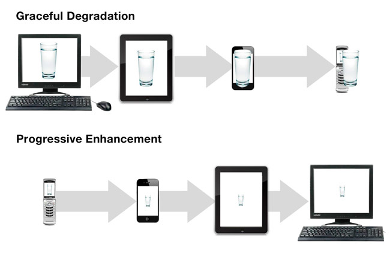

# Fyrirlestur 13.2 – CSS upprifjun

## Vefforritun 1 — TÖL107G

### Andri Valur Guðjohnsen, [avg4@hi.is](mailto:avg4@hi.is)

---

## Hvað er CSS?

* [Cascading Style Sheets](http://en.wikipedia.org/wiki/Cascading_Style_Sheets)
* CSS er style sheet language sem lýsir framsetningu á skjali skrifuðu í markup language, t.d. HTML, XHTML, XML og SVG
* Hannað til að aðskilja efni frá útliti

***

## Specification

* Staðlað af W3C
* [CSS 2.1 W3C recommendation 2011](http://www.w3.org/TR/CSS2/) þó fyrst árið 2004
* CSS level 3 (CSS3) – unnið sem [_módular_](https://www.w3.org/Style/CSS/current-work) ofan á fyrri útgáfur

***

## Málfræði

* Vinnum með _reglusett_, samanstendur af
  - _selectors_
  - _skilgreiningum_
* Athugasemdir eru innan `/* comment */`

***

## Selectors

* Strengur sem lýsir því hvaða element við viljum að taki við _skilgreiningum_
  - Skiptast í sex flokka
* Getum tengt saman
  - Fjórar gerðir af samtengingum

***

## Selectors – flokkar

* _Type selector_, heiti á elementi, t.d. `p`
* _Universal selector_, öll element, `*`
* _Attribute selector_, velur element eftir attribute og innihaldi

***

* _Class selector_, velur element eftir því hvað `class` attribute inniheldur, notar `.` (punkt)
* _ID selector_, velur element eftir því hvað `id` attribute inniheldur
* _Gervi-klasar_ (pseudo-classes), velur hluti sem ekki er hægt að velja með hinum, notum `:`

***

## Selectors – samtenging

* `" "` (bil) þýðir að seinni selector velur element sem er afkomandi fyrri
* `>` er fyrir _strangt barn_, seinni selector verður að vera barna fyrri
* `+` er fyrir _systkini_, seinni selector velur element sem er systkini sem kemur **beint á eftir** fyrri selector
* `~` er almennur systkina selector, seinni selector velur element sem er syskini fyrri

***

## Villumeðhöndlun

* CSS er hannað til að fyrirgefa minniháttar villur, t.d.
  - Ef tvípunkt eða semíkommu vantar í yfirlýsingu
  - Ef heiti eigindis er óþekkt er yfirlýsingin öll hunsuð og haldið áfram að næstu.
* Meiriháttar villur stoppa lestur á skjali frá þeim stað sem þær eiga sér stað

***

## Yfirlýsingar

* Reglusett inniheldur yfirlýsingar:
  - `eigindi: gildi;`
* Mjög mörg eigindi, möguleg gildi færri

***

## Gildi – strengir

* Strengir eru skilgreindir með `"` eða `'`
  - `"this is a 'string'"`
  - `'this is a "string"'`
* Getum notað viðeigandi staf með `\` fyrir framan
  - `"this is a \"string\""`

***

## Gildi – URL

Url skilgreinum við með `url(<slóð>)` þar sem slóð er bein slóð eða slóð í streng.

* `url(http://example.org)`
* `url('http://example.org')`

***

## Gildi – litir

* Lykilorði, t.d. `black`, `white`, `green`
  - `transparent` er einnig lykilorð fyrir alveg gegnsæan lit
* RGB gildi með hexadecimal eða `rgb()`,
  - t.d. `#00ff00` eða `rgb(0, 255, 0)` (bæði gildi eru grænn).
* [HSL](https://en.wikipedia.org/wiki/HSL_and_HSV) gildi með `hsl()`

***

## Gildi – tölur

* Heiltölur
* Rauntölur, með punkt `1.2`
* Prósentur `25.5%`

***

## Hlutfallslegar einingar

* Letur-hlutfallslegar einingar (font-relative lengths)
* Skjá-prósentu einingar (viewport percentage lengths)

***

## Letur-hlutfallslegar einingar

* Horfa til `font-size` eigindsins
* Yfirleitt `em` eða `rem`
* Í grunninn er `1em == 16px` en getum breytt með að setja `font-size` á `html`

***

* Þegar reiknað er úr `em` gildum í elementum sem eiga sér foreldri með skilgreint `em` gildi eru þau _margfölduð_.
* Á ekki við `rem`

***

## Skjá-prósentu einingar

* Hlutfallslegar við stærð _viewports_ sem er yfirleitt stærð vafragluggans.
* `vw` er ein eining á breiddina (_viewport width_) svo `100vw` myndi fylla upp í skjá á breiddina
* `vh` er ein eining á hæðina (_viewport height_) svo `100vh` myndi fylla upp í skjá á hæðina

***

## Að teikna útlit

* Hvernig veit vafri hvaða gildi fyrir hvaða eigindi eigi að nota?
* Reglur og reiknirit
* _specificity_ og _cascade_

***

## Specificity – sértækni

* „Tala“ á forminu `a,b,c,d`
* `a`, 1 ef skilgreint í `style` attribute, annars 0
* `b`, fjöldi `id` selectora
* `c`, fjöldi attribute selectora og gervi-klasa
* `d`, fjöldi elementa og gervi-elementa
* Síðan skeytt saman í tölu sem er _sértækni_

***

## Cascade – „flóðið“

* Þegar útlit er birt þarf að komast að því _nákvæmlega_ hvaða skilgreiningar eigi við hvert element
* Allar skilgreiningar fyrir element fundnar og raðað

***

Skilgreiningar geta komið frá þremur stöðum:

* _User agent_, sjálfgefnir stílar frá tæki sem birtir
* _Notanda_, notandi tækis, t.d. að allt sé stækkað
* _Höfundi_, skilgreiningar frá höfundi vefs

***

## Röðun

1. Skilgreiningum user agents
2. Skilgreiningum notanda
3. Skilgreiningum höfundar
4. Skilgreiningum höfundar merktar með `!important`
5. Skilgreiningum notanda merktar með `!important`
6. Sértækni
7. Röð innan skjals, seinna skilgreint fær forgang

***

## `!important`

* Getum ýtt skilgreiningu upp listann með `!important`
* Hunsar sértækni
* Ekki góð hugmynd

***

## Gildi reiknuð

* Höfum núna þær reglur sem við notum fyrir hvert element, getum fundið skilgreint gildi fyrir hvert eigindi
  - Ef „flóðið“ gefur okkur gildi, notum það
  - Annars, erft gildi
  - Annars, upphafsgildi

***

## Upphafsgildi

* Fyrir aðrar yfirlýsingar eru skilgreind upphafsgildi
* Yfirleitt rökrétt en stundum geta þau valdið okkur vandræðum, sérstaklega með _shorthand_
* T.d. er `background-color` með sjálfgefna gildið `transparent`, engin bakgrunnslitur

***

* Reiknað gildi – reiknað úr hlutfallslegum gildum eins langt og hægt er, t.d. hlutfallsleg breidd m.v. foreldri
* Notað gildi – fáum nákvæm gildi úr öllum, leyst úr háðum gildum
* Raun gildi – gildi notað við birtingu, t.d. þarf að námunda tölur að einhverjum aukastaf

***

## Reset

* Hver vafri stillir sitt user agent stylesheet
* Viljum oft hafa hreinan grunn
* CSS reset setur öll element í „núllstöðu“
* [CSS Tools: Reset CSS](http://meyerweb.com/eric/tools/css/reset/)

***

## Að skrifa CSS

* Notum ekki `id` í selectorum
  - Hátt specificity, getur valdið vandræðum
  - Ekki endurnýtanlegt - aðeins eitt id per síðu
* Nýtum „flóðið“ til að minnka endurtekningar

***

## Box model

Box módelið lýsir því hvernig rétthyrnd box fyrir element eru mynduð.


***

## Boxið

Vídd box er þá reiknað:

```text
width = left margin + right margin
  + left border + right border + left padding
  + right padding + content width
height = top margin + bottom margin
  + top border + bottom border + top padding
  + bottom padding + content height
```

Erfitt að blanda saman hlutfallslegum og nákvæmum stærðum

***

## Box sizing

* CSS3 skilgreinir `box-sizing` sem breytir því hvernig box modelið er reiknað
  - `box-sizing: content-box;` - sjálfgefið gildi, allt tekið með í reikninginn
  - `box-sizing: border-box;` - aðeins margin er tekið með í reikninginn

***

## Visual formatting model

* Gerð boxa
  - `block` vs. `inline` og `display` eigindið
* Eðlilegt flæði
* Staðsetningu með `position`
* Float
* Þriðju víddarinnar

***

## Normal flow – eðlilegt flæði

Ef við höfum ekki skilgreint hvernig element á að haga sér, er það í _eðlilegu flæði_ og er sjálfgefið annað hvort _block_ eða _inline_

* _block_ element forma blokkir og fylla upp í breidd foreldris
* _inline_ element forma ekki blokkir heldur dreifa sér í línur, inline element fá ekki lárétt `margin`, `width` eða `height`

***

## Staðsetning

* `position` eigindi stillir hvernig element hegðar sér:
  - `static` – eðlilegt flæði
  - `relative` – hlutfallslegt í eðlilegu flæði
  - `absolute` – skilgreinum algjörlega hvar box birtist
  - `fixed` – skilgreinum útfrá glugga hvar box er fast

***

## Þriðja víddin

* Box eru ekki aðeins staðsett í tvívíðu rúmi, þau liggja líka á z-ás
* Staðsetning á z-ás ræðst af _stacking order_
* Getum átt við með `z-index: n;` sem setur stacking order eftir okkar höfði
* Hærra `z-index` setur element _nær_ notanda, hærra á z-ás

***

## Floats

* Skilgreint með `float: left`, `right` eða `none`
* Ekki í eðlilegu flæði, heldur er boxi „fleytt“ til hægri eða vinstri m.v. línu sem það er í
* Ef það er ekki nóg lárétt pláss er boxi ýtt niður þar til það kemst fyrir

---

## Progressive enhancement

* Upplifun sem krefst minnstu mögulegrar tækni
* Bætum virkni við eins og stuðningur er til staðar
* Byrjum einfalt og bætum við virkni í lögum

***

1. Skrifum áhugavert, skýrt efni
2. Setjum það upp með aðgengilegu, merkingarfræðilegu HTML
3. Bætum við grunn útliti sem er vel stutt
4. Bætum við flóknara útliti sem er e.t.v. minna stutt
5. Bætum við aukinni virkni með JavaScript

***


***

## Leturgerðir

* Leturgerð segir til um hvaða hönnun á letri við notum til að birta texta
* Í grunninn höfum við aðgang að almennum leturgerðum
* _Vef öruggar_ leturgerðir eru aðgengilegar á langflestum tækjum

***

## CSS virkni

* Letur og útlit texta
* Bakgrunnur og litir
* Gegnsæi og gradients
* CSS variables
* Border og skuggar
* CSS shapes
* object-fit

***

## Flex

* Segjum foreldri að raða börnum sínum með flexbox með `display: flex`
  - Eða `display: inline-flex` til að raða foreldri inline
* Element með `display: flex` eru kölluð _flex containers_
* Börn innan flexbox eru kölluð _flex items_

***

## Ásar


***

## justify-content


***

## align-items


***

## align-content


***

## BEM

Leið til að nota selectora

* _Block_ - hæsta stig á _component_, foreldrið, t.d. `.button`
* _Element_ - börn undir _block_, t.d. `.button__price`
* _Modifier_ - breytir block án þess að hafa áhrif almennt, t.d. `.button--wide`

***


***


***


***

Byggir á, í röð:

1. Sveigjanlegu umbroti, byggðu á grind
2. Sveigjanlegum myndum og miðlum
3. CSS media queries

***

* Birtum...
  - sama efnið...
  - með sama HTML...
  - á sömu slóð
  - en aðlögum okkur að tæki
* Vefurinn er notaður í allskonar tækjum, bregðumst við því!

***

## Mobile first

* Byrjum á upplifun í minni tækjum
* Neyðir þig til að taka ákvarðanir
* Efnið í fyrirrúmi, ekki óþarfa „skraut”
* Progressive enhancement!

***

## Graceful degradation

* Hugtak tengt progressive enhancement, en á haus
* Byggjum fyrir ákveðna upplifun sem krefst nýrrar tækni
* Brotnum _tignarlega niður_ og gefum síðri upplifun í eldri tækni
* Byrjum flókið og lögum okkur _niður_

***



***

## Grind

* Skilgreinum yfirleitt fjölda dálka sem við vinnum með, _cols_
* Fyrir hverja röð skilgreinum við foreldri sem inniheldur efnið, _rows_
* _Gutter_ er plássið á milli dálka
* Getum notað `margin-left` og `margin-right` til að færa efni til í dálkum

***

## Media queries

* Ákveðum „brotpunkta“ í hönnun og breytum flæði
* Stillum media query, t.d.
  - `max-width` – skilgreinum reglur upp að þeirri vídd
  - `min-width` – skilgreinum reglur frá þeirri vídd
  - Hægt að `and`-a saman

***

## Media queries & progressive enhancement

* Að nýta sér mobile first hugsun þýðir að við skilgreinum í grunninn hvernig hlutur fyllir alveg út í pláss sitt
* Eftir því sem meira pláss er til staðar tekur hlutur minna pláss

***

### `<meta name="viewport">`

Getum leiðbeint vafra hvernig síða birtist:

* `width` setur breidd viewports:
  - `tala` – föst breidd
  - `device-width` — viewport er jafnt _logical resolution_ ekki _physical resolution_
* `initial-scale`, upphafs zoom á síðu

***

* `minimum-scale`, hversu lítil síða má verða — hve langt má zooma út
* `maximum-scale`, hversu stór síða má verða — hve langt má zooma inn
* `user-scalable`, má zooma? __viljum ekki banna__

***

## Kvikun

* Kvikun (animation) er þegar við látum eitthvað hreyfast eftir ákveðnum reglum
* Í CSS er hægt að gera það með `transition` og `animation` eigindunum

***

## Umskipti (transition)

* Látum eitt gildi breytast í annað á skilgreindum tíma
* Brúað á milli upphafs- og endagildis

***

## Hröðun

* Hröðunarfall er skilgreint með _rúmfræðilegri bezier kúrvu_ (cubic bezier curve)
* eða lykilorði sem tengt er ákveðinni bezier kúrvu

***

## Animation

* Með `animation` eigindinu getum við útbúið flóknari hreyfingar án þess að nota JavaScript
* Skilgreinum _keyframes_ fyrir hreyfinguna með `@keyframes` at-reglunni

***

* Lykilorð (`from`, `to`) eða prósentugildi sem „selectorar“ innan keyframes
* Gildin segja til um hvernig hreyfing lítur út á viðeigandi stað og mun vafri brúa á milli m.v. gefinn tíma og hröðun

***

## Transform

* Með `transform` eigindinu getum við gert breytingar á tvívíðu og þrívíðu rúmi hluta
  - `translate`, `rotate`, `skew` og `scale`
* Lang flestar af þessum aðgerðum verða fluttar af vafra frá _CPU_ yfir á _GPU_
* **Miklu** hagkvæmari en að reikna út gildi og teikna allt útlit vefs aftur ef við myndum t.d. nota `position`

